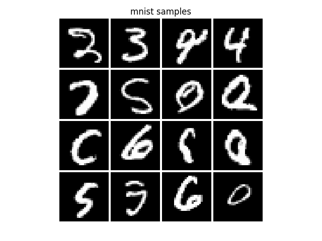
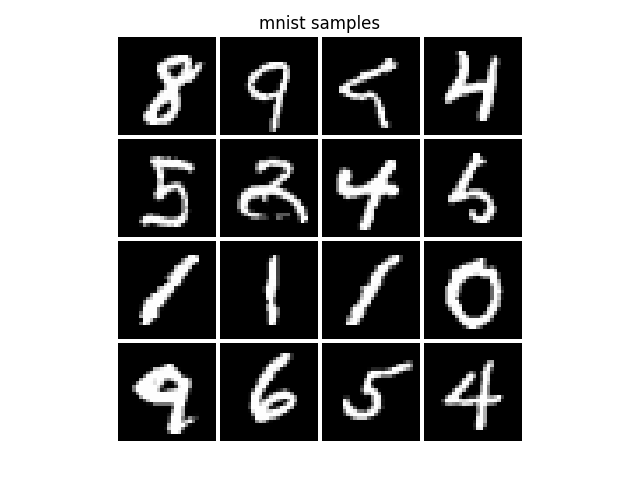
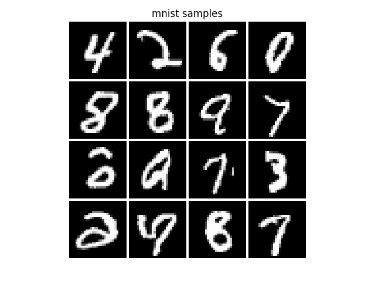
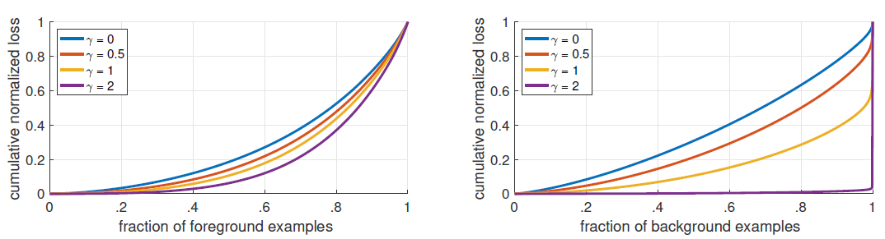
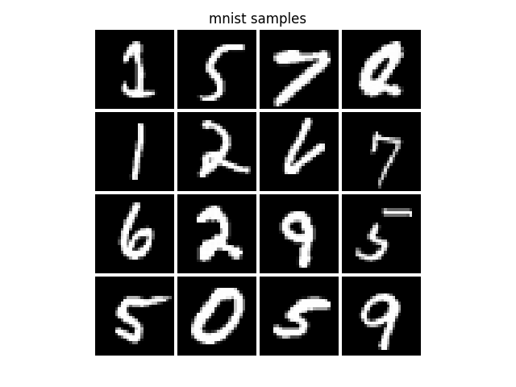

<!-- START doctoc generated TOC please keep comment here to allow auto update -->
<!-- DON'T EDIT THIS SECTION, INSTEAD RE-RUN doctoc TO UPDATE -->
**Table of Contents**  *generated with [DocToc](https://github.com/thlorenz/doctoc)*

- [**pixel-cnn++ (enhanced)**](#pixel-cnn-enhanced)
  - [0. Overview (Seeing the bigger picture)](#0-overview-seeing-the-bigger-picture)
  - [1. Support for MNIST dataset](#1-support-for-mnist-dataset)
  - [2. CoordConv (translation dependencies)](#2-coordconv-translation-dependencies)
  - [3. Non-Local Neural Networks (long range dependencies)](#3-non-local-neural-networks-long-range-dependencies)
  - [4. Focal Loss for Dense Object Detection](#4-focal-loss-for-dense-object-detection)
- [**Original Text**](#original-text)
  - [Setup](#setup)
  - [Training the model](#training-the-model)
  - [Pretrained model checkpoint](#pretrained-model-checkpoint)
  - [Citation](#citation)

<!-- END doctoc generated TOC please keep comment here to allow auto update -->

# **pixel-cnn++ (enhanced)**

**Source**

This is a fork of: https://github.com/openai/pixel-cnn

## 0. Overview (Seeing the bigger picture)

The changes added to the PixelCNN++ model are inspired by understanding the image, its properties & the field of computer vision in general. For example, adding a Non-Local NN block in the network, is like pre-processing the image using the a classical filtering *non-local means* algorithms, capturing long range dependences in images. Convolution gives *translation invariance", but at a cost. It losses *positional context*. Adding the "Coordinates Channels" to the image, before using it as the input to a network, gives the network the ability to learn the *translation dependence* in an image. This is similar to *optical flow* or dynamic image analysis in conventional techniques.

So literally, we are enabling our networks to see the *bigger picture* by enabling it to see long range dependencies & translation dependencies.

These techniques are applicable beyond generative models, and can be used to improve performances of image processing networks. These are like "low/mid level vision" tasks that supplement the semantic/high level vision tasks done by existing networks.

The following enhancements are added:

## 1. Support for MNIST dataset

The original code supports CIFAR-10 and Small Imagenet. Support for MNIST is added. 

**Usage**

Use the following command line option to use MNIST: `--data_set='mnist'`

Sample from the model, with default parameters other than:
- Epochs (`--max_epochs`) = 5
- Number of residual blocks per stage of the model (`--nr_resnet`) = 3



*The MNIST support is adapted from a PyTorch implementation of PixelCNN++: https://github.com/pclucas14/pixel-cnn-pp*

## 2. CoordConv (translation dependencies)

**Source**

Based on the paper:
["An intriguing failing of convolutional neural networks and the CoordConv solution"](https://arxiv.org/pdf/1807.03247)

**Rationale**

Quoting from section 5 of the paper:

*"Well-trained generative models can generate visually compelling images, but careful inspection can reveal mode collapse: images are of an attractive quality, but sample diversity is far less than diversity present in the dataset. Mode collapse can occur in many
dimensions, including those having to do with content, style, or position of components of a scene. We hypothesize that mode collapse of position may be due to the difficulty of learning straightforward transforms from a high-level latent space containing coordinate information to pixel space and that using CoordConv could help."*

Convolution gives *translation invariance", but at a cost. It losses *positional context*. Adding the "Coordinates Channels" to the image, before using it as the input to a network, gives the network the ability to learn the *translation dependence* in an image. This is similar to *optical flow* or dynamic image analysis in conventional techniques.

**Usage**

*Note: Adding additional CoordConv layers to the image, before passing it to the network changes the network architecture. We cannot use existing pretrained networks.*

Use the following command line option to add CoordConv channels: `-ac`

Sample from the model, with default parameters other than:
- CoordConv Layers (`-ac`)
- Epochs (`--max_epochs`) = 5
- Number of residual blocks per stage of the model (`--nr_resnet`) = 3



*The code for this adapted from section S9 of the paper*

## 3. Non-Local Neural Networks (long range dependencies)

**Rationale**

Quoting from section 1 of the paper:

*"Convolutional and recurrent operations both process a local neighborhood, either in space or time; thus long-range dependencies can only be captured when these operations
are applied repeatedly, propagating signals progressively through the data. Repeating local operations has several limitations. First, it is computationally inefficient. Second, it causes optimization difficulties that need to be carefully addressed. Finally, these challenges make multihop dependency modeling, e.g., when messages need to be delivered back and forth between distant positions, difficult. In this paper, we present non-local operations as an efficient, simple, and generic component for capturing long range dependencies with deep neural networks. Our proposed non-local operation is a generalization of the classical non-local mean operation in computer vision."*


*Note: This layer can be used anywhere in the network, and we can still continue using existing pretrained networks. This block, for shape, is an identity translation.*

**Source**

Based on the paper:
["Non-local Neural Networks"](https://arxiv.org/abs/1711.07971)

Use the following command line option to add CoordConv channels: `-nl`

Sample from the model, with default parameters other than:
- CoordConv Layers (`-ac`)
- Non-Local NN block (`-nl`)
- Epochs (`--max_epochs`) = 5
- Number of residual blocks per stage of the model (`--nr_resnet`) = 3



*The code for this is adapted from https://github.com/lucasb-eyer/nonlocal-tf*

## 4. Focal Loss for Dense Object Detection

**Source**

Based on the paper:
["Focal Loss for Dense Object Detection"](https://arxiv.org/abs/1708.02002)

**Rationale**

Quoting section 3.1 & 3.2 of the paper:

*A common method for addressing class imbalance (in object detectors) is to introduce a weighting factor `alpha=[0,1]` for class `1` and `(1 - alpha)` for class `-1`.  ... The large class imbalance encountered during training of dense detectors overwhelms the cross entropy loss. Easily classified negatives comprise the majority of the loss and dominate the gradient. While balances the importance of positive/negative examples, it does not differentiate between easy/hard examples. Instead, we propose to reshape the loss function to down-weight easy examples and thus focus training on hard negatives. ... Intuitively, the modulating factor reduces the loss contribution from easy examples and extends the range in which an example receives low loss.*

When Focal loss is applied to ResNet-101, the cumulative distribution functions for positive and negative samples are shown below:



*Cumulative distribution functions of the normalized loss for positive and negative samples for different values of for a converged model. The effect of changing gamma on the distribution of the loss for positive examples is minor. For negatives, however, increasing gamma heavily concentrates the loss on hard examples, focusing nearly all attention away from easy negatives.*

As we are using ResNet, we have used gamma value of 2. However, its a hyperparameter that needs to be tuned for a given network and dataset.


**Usage**

Use the following command line option to add CoordConv channels: `-fl`

Sample from the model, with default parameters other than:
- CoordConv Layers (`-ac`)
- Non-Local NN block (`-nl`)
- Non-Local NN block (`-nl`)
- Epochs (`--max_epochs`) = 5
- Number of residual blocks per stage of the model (`--nr_resnet`) = 3
- focussing factor (`gamma`) of 2




---------------------
---------------------


# **Original Text**

From: https://github.com/openai/pixel-cnn


This is a Python3 / [Tensorflow](https://www.tensorflow.org/) implementation 
of [PixelCNN++](https://openreview.net/pdf?id=BJrFC6ceg), as described in the following 
paper:

**PixelCNN++: A PixelCNN Implementation with Discretized Logistic Mixture Likelihood and Other Modifications**, by
Tim Salimans, Andrej Karpathy, Xi Chen, Diederik P. Kingma, and Yaroslav Bulatov.

Our work builds on PixelCNNs that were originally proposed in [van der Oord et al.](https://arxiv.org/abs/1606.05328) 
in June 2016. PixelCNNs are a class of powerful generative models with tractable 
likelihood that are also easy to sample from. The core convolutional neural network
computes a probability distribution over a value of one pixel conditioned on the values
of pixels to the left and above it. Below are example samples from a model
trained on CIFAR-10 that achieves **2.92 bits per dimension** (compared to 3.03 of 
the PixelCNN in van der Oord et al.):

Samples from the model (**left**) and samples from a model that is conditioned
on the CIFAR-10 class labels (**right**):


This code supports multi-GPU training of our improved PixelCNN on [CIFAR-10](https://www.cs.toronto.edu/~kriz/cifar.html)
and [Small ImageNet](http://image-net.org/small/download.php), but is easy to adapt
for additional datasets. Training on a machine with 8 Maxwell TITAN X GPUs achieves
3.0 bits per dimension in about 10 hours and it takes approximately 5 days to converge to 2.92.

## Setup

To run this code you need the following:

- a machine with multiple GPUs
- Python3
- Numpy, TensorFlow and imageio packages:
```
pip install numpy tensorflow-gpu imageio
```

## Training the model

Use the `train.py` script to train the model. To train the default model on 
CIFAR-10 simply use:

```
python3 train.py
```

You might want to at least change the `--data_dir` and `--save_dir` which
point to paths on your system to download the data to (if not available), and
where to save the checkpoints.

**I want to train on fewer GPUs**. To train on fewer GPUs we recommend using `CUDA_VISIBLE_DEVICES` 
to narrow the visibility of GPUs to only a few and then run the script. Don't forget to modulate
the flag `--nr_gpu` accordingly.

**I want to train on my own dataset**. Have a look at the `DataLoader` classes
in the `data/` folder. You have to write an analogous data iterator object for
your own dataset and the code should work well from there.

## Pretrained model checkpoint

You can download our pretrained (TensorFlow) model that achieves 2.92 bpd on CIFAR-10 [here](http://alpha.openai.com/pxpp.zip) (656MB).

## Citation

If you find this code useful please cite us in your work:

```
@inproceedings{Salimans2017PixeCNN,
  title={PixelCNN++: A PixelCNN Implementation with Discretized Logistic Mixture Likelihood and Other Modifications},
  author={Tim Salimans and Andrej Karpathy and Xi Chen and Diederik P. Kingma},
  booktitle={ICLR},
  year={2017}
}
```
